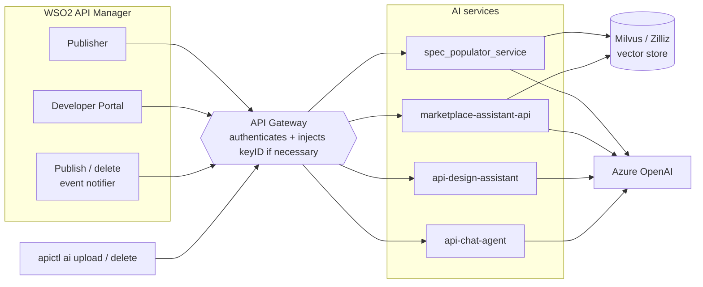
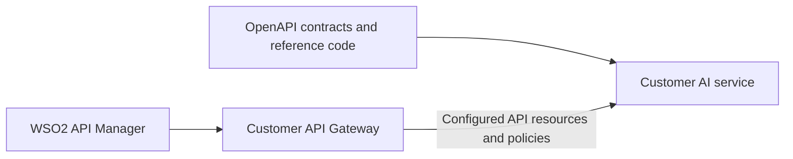

# WSO2 API Manager AI Services Reference Implementations

This repository contains reference implementations and OpenAPI contracts for the backend services used by WSO2 API Manager AI features.

The implementations are provided as development references. Customers should use the relevant OpenAPI contract and sample code to build their own service, deploy it in their environment, and connect it to API Manager through an API Gateway.

## Available References

| Directory | API Manager feature | Contract |
| :--- | :--- | :--- |
| `spec_populator_service` | Marketplace Assistant API indexing | [openapi.yaml](spec_populator_service/openapi.yaml) |
| `marketplace-assistant-api` | Marketplace Assistant chat | [openapi.yaml](marketplace-assistant-api/openapi.yaml) |
| `api-design-assistant` | Design Assistant | [openapi.yaml](api-design-assistant/openapi.yaml) |
| `api-chat-agent` | API Chat | [openapi.yaml](api-chat-agent/openapi.yaml) |

The OpenAPI files define the public contracts. The source code shows one possible implementation and may change as it is aligned with the approved contracts.

## How it fits together



## Integration Model



The expected integration flow is:

1. Select the AI features required for the deployment.
2. Review the corresponding OpenAPI contracts and reference implementations.
3. Develop a customer-owned service that follows the selected contract.
4. Deploy the service in the customer's environment.
5. Expose the required service resources as APIs through the customer's API Gateway.
6. Configure API Manager with the Gateway endpoint and exposed resource paths.
7. Add the `keyID` policy to the Marketplace Assistant Gateway APIs.

## Implement a Compatible Service

The customer service must follow the relevant OpenAPI contract, including:

- Required request fields and data types
- Response and error schemas
- Required HTTP status codes
- Resource-specific validation rules
- Optional additional properties used by the customer deployment

The reference source may be reused or adapted, but it is not a packaged service that customers are expected to deploy unchanged.

For Marketplace Assistant, the indexing and chat operations must use the same vector store, collection, embedding model, and `keyID` value. Otherwise, indexed APIs cannot be retrieved by the chat service.

## Expose the Service Through an API Gateway

Create APIs in the Gateway for the customer service resources and configure the required authentication and mediation policies.

The Gateway resource paths do not need to match any fixed paths shown in this repository. API Manager resource paths are configurable in `deployment.toml`. For example, if the Gateway exposes the indexing resource as `/vectors`, the corresponding API Manager resource configuration can also be set to `/vectors`.

Use the resource configuration properties for the AI features enabled in the deployment. Restart API Manager after changing `deployment.toml`.

Ex:
```toml
[apim.ai]
endpoint = "https://ai-gateway.example.com"
marketplace_assistant_publish_api_resource = "/vectors"
```

## Add the Marketplace Assistant `keyID` Policy

Marketplace Assistant uses `keyID` to partition vector records. API Manager cannot add this query parameter through the available AI service configuration. The **Gateway must therefore derive and append it before forwarding the request**.

Attach the policy to every Marketplace Assistant Gateway API involved in indexing, removal, count, and chat operations.

Below are the list of Marketplace Assistant APIs and corresponding resource paths that require the `keyID` policy. The Gateway must append the `keyID` query parameter to all requests to these resources.

||||
| --- | --- | --- |
| AI Service | Resource Path |
| Marketplace Assistant | `POST /marketplace-assistant` |
| Spec Populator Service | `POST /vectors` |
| Spec Populator Service | `DELETE /vectors` |
| Spec Populator Service | `DELETE /vectors/{uuid}` |
| Spec Populator Service | `GET /vectors/count` |
| Spec Populator Service | `POST /vectors/bulk` |


The policy should use the client identifier from the validated access token. In the WSO2 Gateway, this value is available through `api.ut.consumerKey`, which represents the application's consumer key associated with the `azp` claim.

```xml
<sequence name="ai-inject-keyid" xmlns="http://ws.apache.org/ns/synapse">
    <property name="rest_postfix"
              expression="get-property('axis2','REST_URL_POSTFIX')"/>
    <filter regex=".*\?.*" source="get-property('rest_postfix')">
        <then>
            <property name="REST_URL_POSTFIX"
                      scope="axis2"
                      type="STRING"
                      expression="fn:concat(get-property('rest_postfix'),
                                  '&amp;keyID=',
                                  get-property('api.ut.consumerKey'))"/>
        </then>
        <else>
            <property name="REST_URL_POSTFIX"
                      scope="axis2"
                      type="STRING"
                      expression="fn:concat(get-property('rest_postfix'),
                                  '?keyID=',
                                  get-property('api.ut.consumerKey'))"/>
        </else>
    </filter>
</sequence>
```

The `keyID` value must meet the following requirements:

- The same value must be used for indexing, retrieval, removal, and count operations.
- The value must remain stable after APIs are indexed.
- The application's consumer key must not be regenerated, since previously stored vectors remain associated with the earlier value.
- The value must meet the length restrictions defined in the Marketplace Assistant contract.

For another Gateway implementation, apply the same behavior by reading the `azp` claim from the validated access token and appending it as the `keyID` query parameter.

## Configure API Manager

Configure API Manager to use the Gateway endpoint and the resource paths exposed for the customer service.

```toml
[apim.ai]
enable = true
endpoint = "https://ai-gateway.example.com"
key = "base64encoded<client-credential-of-the-application>"
endpoint = "https://<identity-provider>/oauth2/token"
```

The feature-specific enablement and resource properties can then be set according to the AI features used by the deployment. The exact path is controlled by these properties, so no fixed APIM-to-service route mapping is required in this guide.

Ex: Need to use only Marketplace Assistant with provided Gateway resource paths:
```toml
[apim.ai]
enable = true
marketplace_assistant_publish_api_resource = "/vectors"
marketplace_assistant_chat_resource = "/marketplace-assistant"
marketplace_assistant_remove_api_resource = "/vectors/{uuid}"
marketplace_assistant_api_count_resource = "/vectors/count"
api_chat_enable = false                # since API Chat is not used
design_assistant_enable = false        # since Design Assistant is not used
```

If the deployment uses a custom request property enricher, configure its implementation class as well:

```toml
[apim.ai]
property_enricher_impl = "com.example.apim.ai.CustomerAIRequestPropertyEnricher"
```

The custom properties are appended to the standard request payload. The customer service should define and handle these optional properties while continuing to support the published contract.

## Validation

Validate the integration in this order:

1. Confirm that the customer service responds according to the OpenAPI contract.
2. Confirm that the Gateway routes each configured resource to the correct backend operation.
3. Confirm that the Gateway appends `keyID` to all Marketplace Assistant feature related requests.
4. Publish an API and verify that its vector record is created.
5. Query Marketplace Assistant and verify that it can retrieve the indexed API.
6. Verify any customer-specific properties added through the property enricher.
