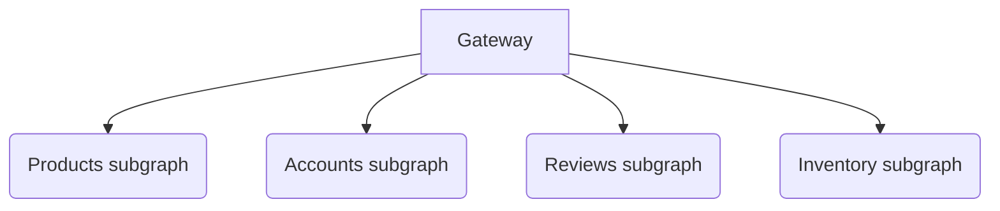

# Netflix DGS Federation Example
Federation example for [netflix-dgs-framework](https://netflix.github.io/dgs/) that closely resembles the 
subgraphs example used in the Apollo Federation [documentation](https://www.apollographql.com/docs/federation/)

## Subgraphs


Products subgraph
```graphql
type Query {
    topProducts(first: Int = 5): [Product]
}

type Product @key(fields: "upc") {
    upc: String!
    name: String
    price: Int
    weight: Int
}
```

Accounts subgraph
```graphql
type Query {
    me: User
}

type User @key(fields: "id") {
    id: ID!
    name: String
    username: String
}
```

Reviews subgraph
```graphql
type Review @key(fields: "id") {
    id: ID!
    body: String
    author: User @provides(fields: "username")
    product: Product
}

type User @key(fields: "id") @extends {
    id: ID! @external
    username: String @external
    reviews: [Review]
}

type Product @key(fields: "upc") @extends {
    upc: String! @external
    reviews: [Review]
}
```

Inventory subgraph
```graphql
type Product @key(fields: "upc") @extends {
    upc: String! @external
    weight: Int @external
    price: Int @external
    inStock: Boolean
    shippingEstimate: Int @requires(fields: "price weight")
}
```