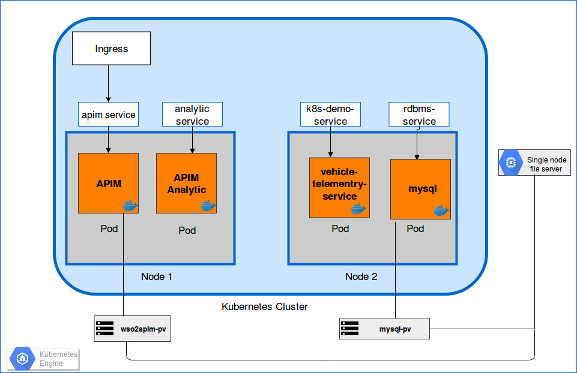

# Kubernetes Demo
*This documentation is to deploy* 

*1. WSO2 API Manager deployment pattern 1 in gcloud Kubernetes Engine and automating a sample backend service.*
*2.Pod auto-scaling in Kubernetes*

*3.Rolling updates on API Manager*

*This is the simplest deployment pattern consists of a scalable deployment of WSO2 API Manager with WSO2 API Manager Analytics support.*





  ## 1. Deploying API Manager In Kubernetes in gcloud
**Overview**

This development would require main steps ,
please follow the each step in details.

1.1 Install Prerequisites

1.2 Deploying WSO2 API Manager in Kubernetes

           
		      A. Creating a Single node file server in gcloud
	              B. Creating a kubernetes Cluster in gcloud
	              C. Deploying WSO2 API Manager and Analytics
	              D. Deploying NGINX Ingress
	   	      E. Access Management Consoles

1.3 Deploying Sample Back end service.


*In order to use WSO2 Kubernetes resources, you need an active WSO2 subscription. If you do not possess an active WSO2 subscription already, you can sign up for a WSO2 Free Trial Subscription from [here](https://wso2.com/free-trial-subscription).*

### Getting Started

### ***1.1 Install Prerequisites***


-   Install Docker v17.09.0 or above
    

	-   [https://docs.docker.com/install/](https://docs.docker.com/install/)
    

-   Install gcloud-sdk
    

	-   [https://cloud.google.com/sdk/install](https://cloud.google.com/sdk/install)
    
    

-   gcloud components install kubectl (compatible with v1.10.0)
    
    
	-   [https://kubernetes.io/docs/tasks/tools/install-kubectl/](https://kubernetes.io/docs/tasks/tools/install-kubectl/)

		 ```
		curl -LO https://storage.googleapis.com/kubernetes-release/release/v1.10.0/bin/linux/amd64/kubectl
		 ```
    

-   Install [](https://git-scm.com/book/en/v2/Getting-Started-Installing-Git) Git
    

	-   [https://git-scm.com/book/en/v2/Getting-Started-Installing-Git](https://git-scm.com/book/en/v2/Getting-Started-Installing-Git)
    
-   Create a Google Cloud Platform [](https://console.cloud.google.com/projectselector/compute/instances) Project
    

	-   [https://cloud.google.com/resource-manager/docs/creating-managing-projects?visit_id=636882414440593811-4047135311&rd=1#identifying_projects](https://cloud.google.com/resource-manager/docs/creating-managing-projects?visit_id=636882414440593811-4047135311&rd=1#identifying_projects)


### ***1.2 Deploying WSO2 API Manager pattern-1***

**A.  Creating a Single node file server in gcloud**
    Steps to create a Single node file server
1.  Login to Google Cloud Console using your Google Account.    
2.  Visit GCP [Marketplace]( https://console.cloud.google.com/marketplace/details/click-to-deploy-images/singlefs)
3.  Click LAUNCH ON COMPUTE ENGINE and select your specific project  
4.  Choose the default configurations ,provide a unique name and the corresponding Zone.
(Name: It must be unique within the project and the zone.
[Zone and Region](https://cloud.google.com/compute/docs/regions-zones/#available) : choosing according to region)

5.  Click Deploy
- A pre-configured [Single node file server](https://cloud.google.com/marketplace/docs/single-node-fileserver) to be used as the persistent volume for artifact sharing and persistence.

 **Ssh to the Single node file server instance by gcloud UI,**

-   create a Linux system user account named wso2carbon with user id 802 and a system group named wso2 with group id   `802`. Add the wso2carbon user to the group wso2.
    
	  ```
	sudo groupadd --system -g 802 wso2  
	sudo useradd --system -g 802 -u 802 wso2carbon
	  ```
-   Create unique directories within the Single node file server instance for each Kubernetes Persistent Volume
    
	   ```
	   mkdir /data/<directory_name>
	   mkdir /data/<directory_name_database>
	   ```
  
-   Grant ownership to wso2carbon user and wso2 group, for each of the previously created directories.
	```
	sudo chown -R wso2carbon:wso2 <directory_name_apim>
	 ```
-   Grant read-write-execute permissions to the wso2carbon user, for each of the previously created directories.
    
	 ```
	sudo chmod -R 700 <directory_name_apim>
	sudo chmod -R 757 <directory_name_database>
	 ```
  
**B.  Creating a kubernetes Cluster in gcloud**
    

Steps to create a kubernetes Cluster

1.  Visit the Google Kubernetes Engine menu in GCP Console.
    
2.  Click Create cluster.
    
3.  Choose the Standard cluster template and Customize the template with the necessary following fields

	-   Name: It must be unique within the project and the zone.
    
	-   [Zone and Region](https://cloud.google.com/compute/docs/regions-zones/#available) : choosing according to region
	-   node pool:choose the default nood pool and customized with necessary fields
	-   Cluster size: The number of nodes to create in the cluster. For this use case **number of nodes are 3.**
	-   Machine type: Compute Engine [machine type](https://cloud.google.com/compute/docs/machine-types) to use for the instances. Each machine type is billed differently. The default machine type is n1-standard-1. This should change to **n1-standard-4 15GB memory**.
	
**C.  Deploying WSO2 API Manager and Analytics**
 
   Clone the [wso2/samples-apim](https://github.com/wso2/samples-apim) master Branch for Kubernetes Resources.
-   Update the Kubernetes Persistent Volume resource with the corresponding Single node file server IP (NFS_SERVER_IP) and exported, NFS server directory path (NFS_LOCATION_PATH) in

	 ```
	kubernetes-apim-2.6x/pattern-1/extras/rdbms/volumes/persistent-volumes.yaml
	kubernetes-apim-2.6x/pattern-1/volumes/persistent-volumes.yaml
	 ```
	(to get the IP address of Single node file server visit VM Instance under the Compute Engine)
  
Next connect to the Kubernetes cluster by Command-line access,follow the steps below to connect to the Kubernetes Cluster.
   
-  Navigate to Clusters under the Kubernetes Engine in gcloud UI
    
-   Select the specific cluster and Click on Connect and copy the Command-line access command and paste it in your local machine (Configure [kubectl](http://kubernetes.io/docs/user-guide/kubectl-overview/) command line access by running the following command: gcloud container clusters get-credentials <CLUSTER_NAME> --zone <ZONE> --project <PROJECT_NAME>)
    

-   Export your WSO2 Username and password as an environmental variable.
    
	```
	export username="< username >"
	export password="< password >"
	```
-   Execute deploy. sh  script in kubernetes-apim-2.6.x/pattern-1/scripts with Kubernetes cluster admin password(visit to your cluster in kubernetes Engine and click Show credentials ).

	 ```
	./deploy.sh --wu=$username--wp=$password--cap=<Kubernetes cluster admin password>
	```
	**Note:** this deploy.sh script will ,
	*create a namespace named  `wso2`  and a service account named  `wso2svc-account`, within the namespace  `wso2`.Then, switch the context to new `wso2` namespace.
Create a Kubernetes Secret to pull the required Docker images from  [`WSO2 Docker Registry`](https://docker.wso2.com/),
Create a Kubernetes ConfigMap for passing database script(s) to the deployment.
Deploy the persistent volume resource and volume claim
Create a Kubernetes service only within the Kubernetes cluster followed by the MySQL Kubernetes deployment.
Create Kubernetes ConfigMaps for passing WSO2 product configurations into the Kubernetes cluster.
Create Kubernetes Services and Deployments for WSO2 API Manager and Analytics.*
-   Check the status of the pod.
	```
	kubect get pods -n wso2
	```
**D.  Deploying NGINX Ingress**
   ##### Deploy Kubernetes Ingress resource.
-   Execute nginx-deploy. sh in kubernetes-demo/nginx with Kubernetes cluster admin password.
This will create NGINX Ingress Controller.
    
	```
	./nginx-deploy.sh --cap=<Kubernetes cluster admin password>
	```
**E.  Access Management Consoles.**
    
deployment will expose `wso2apim` and `wso2apim-gateway` hosts.

-   Obtain the external IP (EXTERNAL-IP) of the Ingress resources by listing down the Kubernetes Ingresses.
	```
	 kubectl get ing
	```
-   Add the above host as an entry in /etc/hosts file as follows:
	```
	< EXTERNAL-IP > wso2apim
	< EXTERNAL-IP > wso2apim-gateway
	```
-   navigate to [https://wso2apim/carbon](https://wso2apim/carbon) , [https://wso2apim/publisher](https://wso2apim/publisher) and [https://wso2apim/store](https://wso2apim/store) from your browser.

	 **Note:**  sign in with **`admin/admin`** credentials.
    

  
### ***1.3 Deploying Sample Backend Service***
 -   Execute service-deploy. sh in kubernetes-demo/sample_service.
    This will create a Kubernetes service and the deployment of the sample backend service under wso2 namespace.
    
		```
		./service-deploy.sh
		```
		
 -   Check the status of the pod.
		```
		kubect get pods -n wso2
		```
		
		
 - Check the services.
	 ```
	 kubectl get services -n wso2
	 ```

		
### Deploying a sample API.
**Creating and publishing An API**
	
	
 - update DATA_FILE and IMAGE in  /automation_scripts/publisher/creat_publish_api/publisher_config.txt.
 
	 ```
	HOST_NAME_APIM="wso2apim"
	PORT=""
	HOST_NAME_GATWAY="wso2apim-gateway"
	PUBLISHER_BASE_PATH="api/am/publisher/v0.14"
	USERNAME="admin"
	PASSWORD="admin"
	PUBLISHER_SCOPE="apim:api_view apim:api_create apim:api_publish"
	DATA_FILE="../create_publish_api/HelloBallerinaAPI/helloballerinadata.json"
	IMAGE="../create_publish_api/HelloBallerinaAPI/hello.jpeg"
	TIER="Unlimited"
	```

	(DATA_FILE:path for the json payload file which specifying the details of the API with API definition
	USERNAME and PASSWORD will be **`admin/admin`** as default.
	IMAGE:thumbnail image  file path of an API) 
	
	Please  refer [RESTful API for WSO2 API Manager - Publisher](https://docs.wso2.com/display/AM260/apidocs/publisher/index.html) for further details.

 - Execute create_publish_aip.sh in /automation_scripts/publisher/publisher_create_publish_api/.
 This will create a **HelloBallerinaAPI** in API Manager Publisher  API and Publish it.
	 ```
	 ./create_publish_aip.sh
	```
	
### Creating a Sample Application.

 - Update API_NAME,APPLICATION_DATA_FILE in
   /automation_scripts/store/create_application/store_config.txt
   
   ```
    HOST_NAME_APIM="wso2apim"
	HOST_NAME_GATEWAY="wso2apim-gateway"
	PORT=""
	STORE_BASE_PATH="api/am/store/v0.14"
	STORE_SCOPE="apim:subscribe"
	USERNAME="admin"
	PASSWORD="admin"
	API_NAME="HelloBallerinaAPI"
	APPLICATION_DATA_FILE="../create_application/HelloBallerinaApp/helloballerina_application_data.json"
	```
	
 - Execute app_create_sub subscribe .sh in
   /automation_scripts/publishercreat_publish_api/.
	 This will create a **HelloBallerinaApplication**  Applicaction in API Manager Store and get a subscription.
	 ```
	 ./app_create_subscribe.sh
	 ```
	 
	 Please  refer [RESTful API for WSO2 API Manager - Store](https://docs.wso2.com/display/AM260/apidocs/store/index.html) for further details.
  ## 2.Pod Auto-scaling
 Horizontal Pod autoscaler will scales the number of pod replicas based on observed CPU utilization provided metrics.
 [https://kubernetes.io/docs/tasks/run-application/horizontal-pod-autoscale/](https://kubernetes.io/docs/tasks/run-application/horizontal-pod-autoscale/)
 -   Provide CPU limit and CPU request for the Container by including **resources:limits,resources:requests** in kubernetes-apim-2.6x/pattern-1/apim/wso2apim-deployment.yml
	 ```
	 - resources:
	       requests:
	           memory: "2Gi"
	           cpu: "2000m"
	       limits:
	           memory: "3Gi"
	           cpu: "3000m"
	           
	  ```
  -   Create a Horizontal Pod Autoscaler that maintains between 1 and 2 replicas of the Pods controlled by wso2apim-with-analytics-apim deployment.
HPA will increase and decrease the number of replicas (via the deployment) to maintain an average CPU utilization across all Pods of 10%
		```
		kubectl autoscale deployment wso2apim-with-analytics-apim --cpu-percent=10 --min=1 --max=2 -n wso2
		```

-   check the current status of autoscaler
	```
	kubectl get hpa wso2apim-with-analytics-apim -n wso2
	```
 ## 3.Rolling updates on API Manager
 
-   Change the Docker Image of kubernetes-apim-2.6x/pattern-1/apim/wso2apim-deployment.yml
	 ```  
		spec:
		       containers:
		        - name: wso2apim-with-analytics-apim-worker
			   image: docker.wso2.com/wso2am:2.6.0 
	 ``` 
  

-   Redeploy the deployment.
	 ```  
	kubectl apply -f wso2apim-update-deployment.yaml -n wso2
	 ```  
